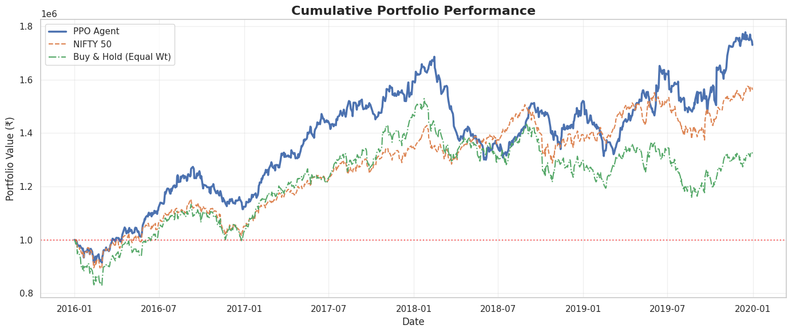
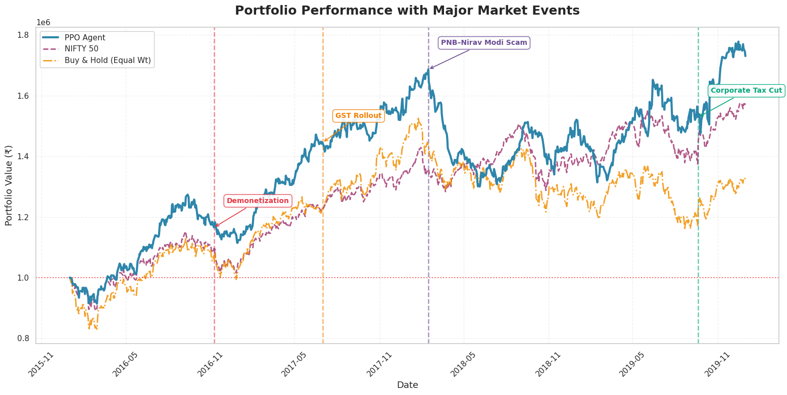
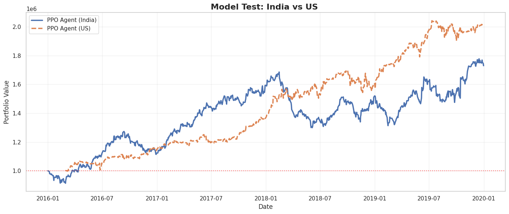

# Deep Reinforcement Learning for Stock Trading (NIFTY 50)


A PPO-based reinforcement learning agent that learns direct portfolio allocation decisions on Indian equity market data (NIFTY 50 constituents, 2010–2019), with turbulence-aware risk control, rolling retraining, and zero-shot cross-market generalization to US equities.

---

## Table of Contents

- [Project Overview](#project-overview)
- [Repo Structure](#repo-structure)
- [Dataset](#dataset)
- [Environment Design](#environment-design)
- [Algorithm](#algorithm)
- [Training Configuration](#training-configuration)
- [Results](#results)
- [Visualizations](#visualizations)
- [Reproducibility](#reproducibility)
- [Requirements](#requirements)
- [How to Run](#how-to-run)
- [Key Takeaways](#key-takeaways)
- [Limitations](#limitations)
- [References](#references)

---

## Project Overview

Most algorithmic trading systems predict future prices and derive actions from those predictions. This project takes a different approach — it formulates portfolio trading directly as a Markov Decision Process and learns a policy that maximizes risk-adjusted portfolio value end-to-end, without intermediate price prediction.

The agent trades a fixed universe of 40 NIFTY 50 constituents (as of 2010) under realistic constraints: transaction costs, non-negative cash balance enforcement, and a turbulence index that triggers risk-off behavior during extreme market conditions. A rolling retraining protocol prevents lookahead bias — at each quarter, the model is retrained on all available history before trading the next quarter out-of-sample.

The final experiment transfers the India-trained policy, frozen and without any retraining, to a 40-stock US equity universe to test whether the agent has learned generalizable trading structure or has overfit to Indian market dynamics.

The implementation follows the formulation in Yang et al. (ICAIF 2020), adapted for NIFTY 50 data and extended with the cross-market generalization test.

---

## Repo Structure

```
.
├── StockTrading.ipynb       # Main notebook
├── stocktrading.py          # Script version
├── images/
│   ├── plot_1.png           # Cumulative portfolio performance vs benchmarks
│   ├── plot_2.png           # Performance with major market events annotated
│   └── plot_3.png           # India vs US cross-market comparison
└── README.md
```

---

## Dataset

**Source:** Yahoo Finance via `yfinance`

**Indian Universe:** 40 fixed NIFTY 50 constituents (2010 composition)
**US Universe:** 40 large-cap US stocks (used only for out-of-distribution testing)

| Property | Indian Data | US Data |
|---|---|---|
| Stocks | 40 | 40 |
| Period | Nov 2009 – Jan 2020 | Jan 2016 – Dec 2019 |
| Training period | Jan 2010 – Dec 2015 | — (no training) |
| Evaluation period | Jan 2016 – Dec 2019 | Jan 2016 – Dec 2019 |
| Initial capital | ₹1,000,000 | ₹1,000,000 |
| Frequency | Daily | Daily |

Technical indicators computed per stock: MACD, RSI, CCI, ADX.

---

## Environment Design

The custom `StockTradingEnv` (Gymnasium) models portfolio trading as an MDP.

### State Space

At each timestep t, the agent observes:

```
s_t = [balance, prices (×40), holdings (×40), MACD (×40), RSI (×40), CCI (×40), ADX (×40)]
```

Total state dimension: 1 + 40 + 40 + 40 + 40 + 40 + 40 = **241**

### Action Space

Continuous actions in [-1, 1] per stock (40-dimensional). Actions are scaled by `H_MAX = 100` and mapped to shares bought or sold. Actions are clipped automatically to satisfy cash constraints and maximum position limits — the agent never holds more than 100 shares per stock and never goes into negative cash.

### Reward Function

```
r_t = (b_{t+1} + P_{t+1}ᵀ h_{t+1}) - (b_t + Pₜᵀ hₜ) - transaction_cost
```

The reward is the change in total portfolio value minus transaction costs (0.1% per trade). This aligns the agent's objective directly with portfolio growth, not price prediction.

### Turbulence Index

Market turbulence is computed using the Mahalanobis distance of daily returns relative to historical covariance. When turbulence exceeds a threshold:
- New buy orders are blocked
- Forced liquidation of holdings may be triggered

This implements a systematic risk-off mechanism during periods of abnormal market behavior such as crashes or extreme volatility.

### Rolling Window Protocol

Training uses an expanding window from 2010. At each quarter boundary:
1. The PPO model is retrained on all history up to that point (15,000 timesteps per window)
2. The retrained model trades the next quarter out-of-sample
3. Portfolio value carries over between windows; holdings are liquidated at each window boundary

This prevents any lookahead bias in the evaluation period.

---

## Algorithm

**PPO (Proximal Policy Optimization)** from `stable-baselines3` — not a custom implementation.

PPO is chosen for this problem because:
- The action space is continuous and 40-dimensional — policy gradient methods handle this more naturally than discrete DQN variants
- PPO's clipped objective prevents destructive large policy updates, which is important in noisy financial environments where reward signals are non-stationary
- GAE (Generalized Advantage Estimation) reduces variance in policy gradient estimates

The policy and value networks share the same MLP backbone with architecture `[128, 128]`.

---

## Training Configuration

| Parameter | Value |
|---|---|
| Algorithm | PPO (stable-baselines3) |
| Policy network | MLP [128, 128] |
| Learning rate | 5e-4 |
| n_steps | 1,024 |
| Batch size | 64 |
| n_epochs | 10 |
| Entropy coefficient | 0.005 |
| Clip range | 0.2 |
| Discount factor (γ) | 0.99 |
| GAE lambda | 0.95 |
| Timesteps per training window | 15,000 |
| Transaction cost | 0.1% per trade |
| Max shares per stock (H_MAX) | 100 |
| Risk-free rate (Sharpe) | 6% annual (Indian T-bill) |
| Random seed | 21 |

---

## Results

### Overall Performance (2016–2019)

| Strategy | Final Value | Return | Sharpe | Max Drawdown | Volatility |
|---|---|---|---|---|---|
| **PPO Agent** | **₹1,729,865** | **72.99%** | **0.61** | **−22.91%** | **15.62%** |
| NIFTY 50 Index | ₹1,561,800 | 56.18% | 0.50 | −14.55% | 13.00% |
| Buy & Hold (Equal Wt) | ₹1,322,604 | 32.26% | 0.16 | −24.32% | 16.21% |

> The PPO agent outperforms both passive benchmarks on return and Sharpe ratio. Its maximum drawdown (−22.91%) is higher than NIFTY 50 (−14.55%) but lower than equal-weight Buy & Hold (−24.32%), reflecting an active risk profile with better recovery behavior. Sharpe ratios use a 6% annual risk-free rate consistent with Indian T-bill rates over the evaluation period.

---

### Cross-Market Generalization (Zero-Shot Transfer)

The India-trained PPO model is evaluated on 40 US large-cap stocks over the same 2016–2019 period, with no retraining or fine-tuning. The model weights are frozen (`deterministic=True`).

| Market | Universe | Return |
|---|---|---|
| **PPO Agent — India** | 40 NIFTY constituents | 72.99% |
| **PPO Agent — US (zero-shot)** | 40 US large-caps | 100.20% |

The US market produced stronger returns over this period (2016–2019 was a sustained bull run for US equities), which partially explains the higher absolute return. The frozen India-trained policy generating positive and competitive returns on a structurally different market suggests the agent has learned generalizable trading behavior — dynamic position sizing based on technical signals — rather than memorizing India-specific price patterns.

---

## Visualizations

**Cumulative Portfolio Performance vs Benchmarks (2016–2019)**



The PPO agent (blue) leads both benchmarks throughout most of the evaluation period. The equal-weight Buy & Hold (green dashed) underperforms significantly, particularly post-2018. The agent's ability to dynamically reduce exposure during downturns is visible in its shallower drawdown recovery relative to passive strategies.

---

**Portfolio Performance with Major Market Events**



Four major Indian macroeconomic events are annotated:

- **Demonetization (Nov 2016)** — sharp drawdown across all strategies; PPO recovers faster than benchmarks
- **GST Rollout (Jul 2017)** — market uncertainty around implementation; PPO maintains its lead
- **PNB–Nirav Modi Scam (Feb 2018)** — banking sector shock; PPO's turbulence mechanism reduces exposure, visible in the flatter drawdown curve relative to benchmarks
- **Corporate Tax Cut (Sep 2019)** — market rally; PPO captures the upside and ends the period at its highest value

---

**Cross-Market Comparison: India vs US**



Both curves start at ₹1,000,000. The US policy (orange dashed) diverges upward from mid-2018 onward, reflecting the stronger US bull market in that period. The India policy trajectory is consistent with plot_1. The crossing and convergence periods in 2016–2017 confirm the agent adapts its position sizing to local signal magnitudes rather than applying fixed rules.

---

## Reproducibility

All sources of randomness are seeded globally:

```python
SEED = 21
random.seed(SEED)
np.random.seed(SEED)
torch.manual_seed(SEED)
torch.cuda.manual_seed_all(SEED)
torch.backends.cudnn.deterministic = True
torch.backends.cudnn.benchmark = False
os.environ["PYTHONHASHSEED"] = str(SEED)
```

Results are reproducible given the same `yfinance` data pull. Note that `yfinance` data can shift slightly over time due to corporate action adjustments — exact numbers may vary marginally on future runs.

---

## Requirements

```
stable-baselines3
gymnasium
yfinance
pandas
numpy
torch
matplotlib
seaborn
```

Install with:

```bash
pip install stable-baselines3 gymnasium yfinance pandas numpy torch matplotlib seaborn
```

---

## How to Run

Open `StockTrading.ipynb` in Google Colab or Jupyter and run all cells in order. The notebook handles data download, indicator computation, environment setup, rolling training, evaluation, and all three plots.

---

## Key Takeaways

- The turbulence index is the most consequential design choice in this project. Without it, the agent takes on unconstrained risk during market shocks and suffers disproportionate drawdowns. The Mahalanobis-distance mechanism provides a model-free regime change signal that requires no labeled data.
- Rolling retraining with an expanding window is essential for honest evaluation. A single train/test split on financial data leaks regime information — the rolling protocol ensures every trading day is genuinely out-of-sample.
- The cross-market transfer result is the most interesting finding. A frozen policy trained on Indian equities generates 100% return on US equities over the same period without any adaptation, suggesting the agent learns to respond to technical indicator patterns rather than memorizing Indian market structure.
- Holdings are liquidated at each rolling window boundary. This is a conservative design choice that avoids position carryover complexity but introduces forced transaction costs at every retraining boundary.
- The PPO agent's Sharpe ratio (0.61) beats both benchmarks but remains modest in absolute terms. The agent's edge is primarily in drawdown management and recovery speed, not raw return generation.

---

## Limitations

- The stock universe is fixed at 40 NIFTY constituents as of 2010. Survivorship bias is present — companies that were delisted or removed from the index between 2010 and 2019 are excluded.
- The US cross-market test covers 2016–2019, a strong bull market for US equities. A test on a bear market period or a market crash window would be more informative about the policy's true robustness.
- The current policy network is a flat MLP that processes all 40 stocks independently. A recurrent policy or attention mechanism over the stock universe could capture inter-stock correlations that the current architecture ignores.
- Transaction costs are fixed at 0.1%. Real Indian equity trading involves additional costs — STT, brokerage, GST on brokerage, and SEBI charges — that would reduce realized returns.
- The turbulence threshold is static within each rolling window. A dynamic threshold that adapts to intra-quarter regime shifts would be more robust.

---

## References

- Yang et al., *Deep Reinforcement Learning for Automated Stock Trading: An Ensemble Strategy*, ICAIF 2020
- Stable-Baselines3 documentation — PPO
- Gymnasium — custom environment API
